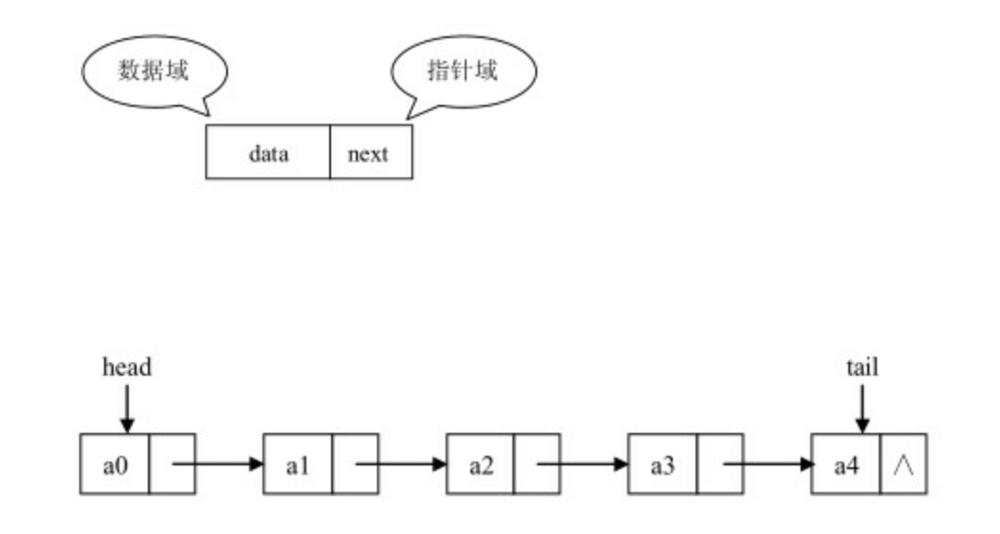
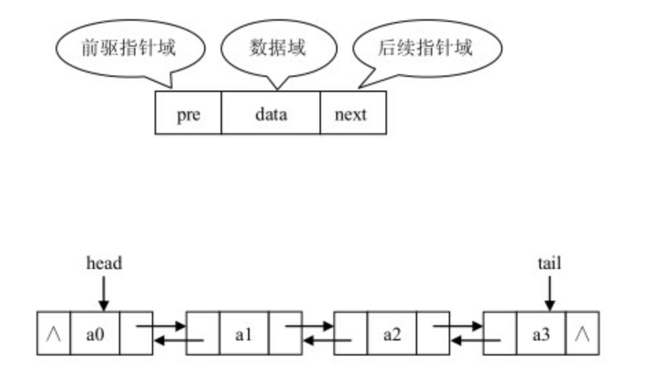
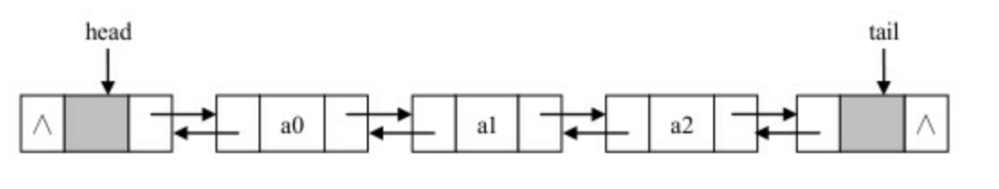
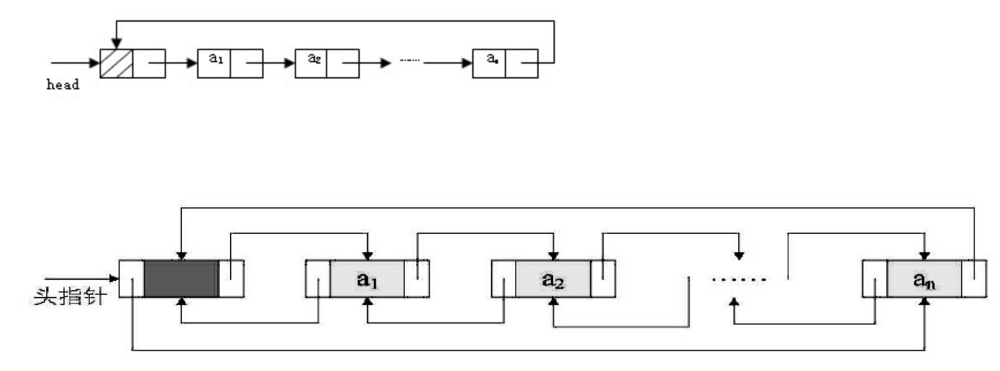

# 1.链表概述

链表是一系列的存储数据元素的单元通过指针串接起来形成的，因此每个单元至少有两个域，一个域用于数据元素的存储，另一个或两个域是指向其他单元的指针。这里具有一个数据域和多个指针域的存储单元通常称为节点（node）。
链表的第一个节点和最后一个节点，分别称为链表的头节点和尾节点。尾节点的特征是其 next 引用为空（null）。链表中每个节点的 next 引用都相当于一个指针，指向另一个节点，借助这些 next 引用，我们可以从链表的头节点移动到尾节点。
链表数据结构中主要包含单向链表、双向链表及循环链表。

## 1.1 单向链表

单向链表只有一个指针域，在整个节点中数据域用来存储数据元素，指针域用于指向下一个具有相同结构的节点。

　　单向链表中，每个节点的数据域都是通过一个 Object 类的对象引用来指向数据元素的，与数组类似，单向链表中的节点也具有一个线性次序，即如果节点 a1 的 next 引用指向节点 a2，则 a1 就是 a2 的直接前驱，a2 是 a1 的直接后续。只能通过前驱节点找到后续节点，而无法从后续节点找到前驱节点。
特点：
　　数据元素的存储对应的是不连续的存储空间，每个存储结点对应一个需要存储的数据元素。每个结点是由数据域和指针域组成。 元素之间的逻辑关系通过存储节点之间的链接关系反映出来。
　　逻辑上相邻的节点物理上不必相邻。
缺点：
1、比顺序存储结构的存储密度小 (每个节点都由数据域和指针域组成，所以相同空间内假设全存满的话顺序比链式存储更多)。
2、查找结点时链式存储要比顺序存储慢（每个节点地址不连续、无规律，导致按照索引查询效率低下）。
优点：
1、插入、删除灵活 (不必移动节点，只要改变节点中的指针，但是需要先定位到元素上)。
2、有元素才会分配结点空间，不会有闲置的结点。

## 1.2 双向链表

要在单向链表中找到某个节点的前驱节点，必须从链表的头节点出发依次向后寻找，但是需要Ο(n)时间。为此我们可以扩展单向链表的节点结构，使得通过一个节点的引用，不但能够访问其后续节点，也可以方便的访问其前驱节点。扩展单向链表节点结构的方法是，在单链表节点结构中新增加一个域，该域用于指向节点的直接前驱节点。该链表称为双向链表。单向链表只能从一个方向遍历，双向链表可以从两个方向遍历。

　在使用双向链表实现链接表时，为使编程更加简洁，我们使用带两个哑元节点的双向链表来实现链接表。其中一个是头节点，另一个是尾节点，它们都不存放数据元素，头节点的pre 为空，而尾节点的 Next 为空。

在具有头尾节点的双向链表中插入和删除节点，无论插入和删除的节点位置在何处，因为首尾节点的存在，插入、删除操作都可以被归结为某个中间节点的插入和删除；并且因为首尾节点的存在，整个链表永远不会为空，因此在插入和删除节点之后，也不用考虑链表由空变为非空或由非空变为空的情况下 head 和 tail 的指向问题；从而简化了程序。

## 1.3 循环链表

头节点和尾节点被连接在一起的链表称为循环链表，这种方式在单向和双向链表中皆可实现。循环链表中第一个节点之前就是最后一个节点，反之亦然。

