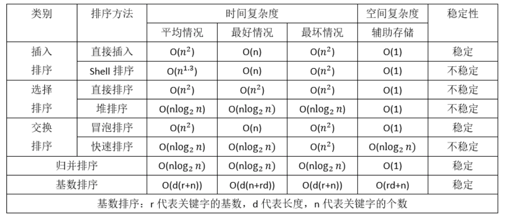

# 1.算法时间复杂度

## 1.1算法时间复杂度的定义：

在进行算法分析时，语句总的执行次数T(n)是关于问题规模n的函数，进而分析T(n)随n的变化情况并确定T(n)的数量级。算法的时间复杂度，也就是算法的时间量度，记作：T(n)= O(f(n))。它表示随问题规模n的增大，算法执行时间的增长率和f(n)的增长率相同，称作算法的渐近时间复杂度，简称为时间复杂度，是一种“渐进表示法”。其中f(n)是问题规模n的某个函数。

用大写O()来体现算法时间复杂度的记法，我们称之为大O记法。

一般情况下，随着输入规模n的增大，T(n)增长最慢的算法为最优算法。
显然，由此算法时间复杂度的定义可知，我们的三个求和算法的时间复杂度分别为O(1)，O(n)，O(n^2)。

## 1.2.推导大O阶方法

分析一个算法的时间复杂度步骤：

* 用常数1取代运行时间中的所有加法常数。
* 在修改后的运行次数函数中，只保留最高阶项。
* 如果最高阶项系数存在且不是1，则去除与这个项相乘的常数。
* 得到的最后结果就是大O阶。

①常数阶

例：段代码的大O是多少？

```go
var sum, n int = 0, 100
printf(“I love you.com\n”);
printf(“I love you.com\n”);
printf(“I love you.com\n”);
printf(“I love you.com\n”);
printf(“I love you.com\n”);
printf(“I love you.com\n”);
sum = (1+n)*n/2;
```


第一条就说明了所有加法常数给他个O(1)即可

②线性阶：一般含有非嵌套循环涉及线性阶，线性阶就是随着问题规模n的扩大，对应计算次数呈直线增长。

```go
var i , n, sum int = 100, 100, 0 
for( i=0; i < n; i++ )
{
    sum = sum + i;
}
```


上面这段代码，它的循环的时间复杂度为O(n)，因为循环体中的代码需要执行n次。

③平方阶

```go
var  i, j, n int = 100, 100, 100
for( i=0; i < n; i++ )
{
    for( j=0; j < n; j++ )
    {
        printf(“I love FishC.com\n”);
    }
}
```


n等于100，也就是说外层循环每执行一次，内层循环就执行100次，那总共程序想要从这两个循环出来，需要执行100*100次，也就是n的平方。所以这段代码的时间复杂度为O(n^2)。

总结：如果有三个这样的嵌套循环就是n^3。所以总结得出，循环的时间复杂度等于循环体的复杂度乘以该循环运行的次数。

```go
int i, j, n = 100, 100, 100
for( i=0; i < n; i++ )
{
    for( j=i; j < n; j++ )
    {
        printf(“I love FishC.com\n”);
    }
}
```

由于当i=0时，内循环执行了n次，当i=1时，内循环则执行n-1次……当i=n-1时，内循环执行1次，所以总的执行次数应该是：
n+(n-1)+(n-2)+…+1 = n(n+1)/2
n(n+1)/2 = n^2/2+n/2
用我们推导大O的攻略，第一条忽略，因为没有常数相加。第二条只保留最高项，所以n/2这项去掉。第三条，去除与最高项相乘的常数，最终得O(n^2)。

④对数阶

```go
var i , n int = 1, 100
while( i < n )
{
    i = i * 2;
}
```

由于每次i*2之后，就距离n更近一步，假设有x个2相乘后大于或等于n，则会退出循环。
于是由2^x = n得到x = log(2)n，所以这个循环的时间复杂度为O(logn)。

## 1.3 函数调用的时间复杂度分析

```go
var i, j int
for(i=0; i < n; i++) {
    function(i);
}
func function(int count) {
    printf(“%d”, count);
}
```


函数体是打印这个参数，这很好理解。function函数的时间复杂度是O(1)，所以整体的时间复杂度就是循环的次数O(n)。

假如function是下面这样：

```go
func function(int count) {
    int j;
    for(j=count; j < n; j++) {
        printf(“%d”, j);
    }
}
```

事实上，这和之前平方阶的时候举的第二个例子一样：function内部的循环次数随count的增加(接近n)而减少，所以根据游戏攻略算法的时间复杂度为O(n^2)。

```go
n++; //1
function(n); //1
for(i=0; i < n; i++) { //n
    function(i);
}
for(i=0; i < n; i++) { //n^2
    for(j=i; j < n; j++) {
        printf(“%d”, j);
    }
}
func function(int count) {
    printf(“%d”, count);
}
```


为：1+1+n+n2，所以最后是O(n2) 

常用的时间复杂度所耗费的时间从小到大依次是：
O(1) < O(logn) < (n) < O(nlogn) < O(n^2) < O(n^3) < O(2^n) < O(n!) < O(n^n)

## 1.4 最坏情况与平均情况

我们查找一个有n个随机数字数组中的某个数字，最好的情况是第一个数字就是，那么算法的时间复杂度为O(1)，但也有可能这个数字就在最后一个位置，那么时间复杂度为O(n)。
平均运行时间是期望的运行时间。
最坏运行时间是一种保证。在应用中，这是一种最重要的需求，通常除非特别指定，我们提到的运行时间都是最坏情况的运行时间。

# 2. 算法的空间复杂度

我们在写代码时，完全可以用空间来换去时间。
举个例子说，要判断某年是不是闰年，你可能会花一点心思来写一个算法，每给一个年份，就可以通过这个算法计算得到是否闰年的结果。
另外一种方法是，事先建立一个有2050个元素的数组，然后把所有的年份按下标的数字对应，如果是闰年，则此数组元素的值是1，如果不是元素的值则为0。这样，所谓的判断某一年是否为闰年就变成了查找这个数组某一个元素的值的问题。

第一种方法相比起第二种来说很明显非常节省空间，但每一次查询都需要经过一系列的计算才能知道是否为闰年。第二种方法虽然需要在内存里存储2050个元素的数组，但是每次查询只需要一次索引判断即可。

这就是通过一笔空间上的开销来换取计算时间开销的小技巧。到底哪一种方法好？其实还是要看你用在什么地方。

## 2.1 算法的空间复杂度定义

算法的空间复杂度通过计算算法所需的存储空间实现，算法的空间复杂度的计算公式记作：S(n)=O(f(n))，其中，n为问题的规模，f(n)为语句关于n所占存储空间的函数，也是一种“渐进表示法”，这些所需要的内存空间通常分为“固定空间内存”（包括基本程序代码、常数、变量等）和“变动空间内存”（随程序运行时而改变大小的使用空间）

通常，我们都是用“时间复杂度”来指运行时间的需求，是用“空间复杂度”指空间需求。
当直接要让我们求“复杂度”时，通常指的是时间复杂度。

## 2.2 计算方法

 忽略常数，用O(1)表示 
递归算法的空间复杂度=递归深度N*每次递归所要的辅助空间 
对于单线程来说，递归有运行时堆栈，求的是递归最深的那一次压栈所耗费的空间的个数，因为递归最深的那一次所耗费的空间足以容纳它所有递归过程。

```go
var a = 0
var b = 0
print(a,b)
```


它的空间复杂度O（n）=O（1）；

```go
fun(n)()
    k = 10
    if n == k:
        return n
    else:
        return fun(++n)
```


递归实现，调用fun函数，每次都创建1个变量k。调用n次，空间复杂度O（n*1）=O（n)。

```go
for(i=0;i<n;++){
  temp = i
}
```

 变量的内存分配发生在定义的时候，因为temp的定义是循环里边，所以是n*O(1)

```go
temp=0;
for(i=0;i<n;i++){
   temp = i
}
```


temp定义在循环外边，所以是1*O(1) 

# 3. 常用算法的时间复杂度和空间复杂度



参考：https://blog.csdn.net/qq_17534301/article/details/82872357